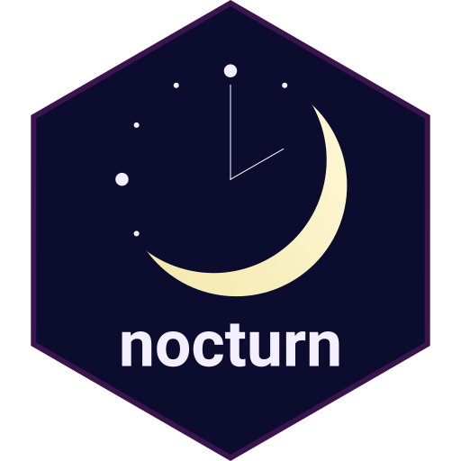
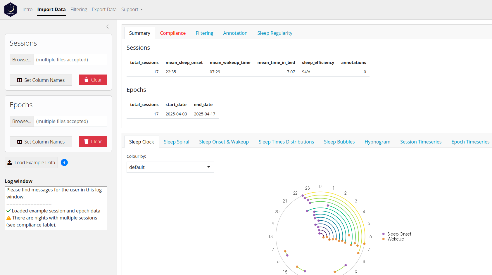

# Summary

nocturn was designed to enable rapid and easy exploration of sleep data, regardless of the data collection method used. It provides a graphical user interface using R shiny, as well as functions that can be imported as an R package. nocturn is particularly suited to the visualisation of large longitudinal sleep datasets, e.g. ranging over several months. It allows filtering data, and generating visualisations and metrics to assess sleep regularity. The graphical interface makes the app easily usable without any programming experience, while the functions available in the R package are aimed at power-users who wish to produce their own automated workflows.

{width="500"}

# Glossary

| Term    | Definition                                    |
| ------- | --------------------------------------------- |
| User    | The person using the nocturn app or R package |
| Subject | The person whose sleep has been recorded      |
| Night   | The date of a sleep session, calculated from 12pm to 12pm. For example, all sessions between 2025-01-01 12:00 and 2025-01-02 12:00 will be part of night "2025-01-01" |

Table: Glossary of terms used in the nocturn app.

# Statement of need

Advances in Open Science and data sharing have lead to the publication of a large number of sleep monitoring datasets, as can be found on the [National Sleep Research Resource](https://sleepdata.org) (NSRR), or on general repositories such as [Zenodo](https://zenodo.org). While Polysomnography (PSG) remains the gold standard for sleep monitoring, other methods such as actigraphy and radar-sensing are being used for longitudinal studies, and to study people's sleep in their home environment. The increasing availability of these data makes it essential to have tools that allow rapid, high-level exploration of sleep data recorded through different modalities. Current software for sleep data analysis either focuses exclusively on one data type (e.g. actigraphy or PSG), is not always free to use or open-source, and is often difficult to integrate with other tools to build analysis pipelines. To avoid these pitfalls, nocturn was designed according to the FAIR principles (making software that is Findable, Accessible, Interoperable and Reusable), making it easy to integrate into existing analysis pipelines.

nocturn was developed to be used by researchers studying sleep, to enable them to:

- Explore sleep data, regardless of their familiarity with programming languages
- Apply thresholds on key variables (such as time spent in bed) to remove spurious sleep sessions
- Generate attractive visualisations that can be used in research outputs during and after the project
- Produce sleep summary reports to be shared with study participants
- Create automated workflows to quickly produce the outputs listed above for a large number of participants

nocturn is currently being used for data analysis in the Ambient-BD project, which studies sleep and circadian rhythm in 180 participants diagnosed with Bipolar Disorder over 18 months [@Manrai2025].

# Main functionalities

## Graphical interface

The nocturn graphical interface features three main menus, which can be accessed using the top navigation bar, and are displayed in the app's sidebar (\autoref{fig:nocturn_main}). **Import Data** allows importing Session and Epoch data (more on data types below), and setting column names, i.e. specifying which columns in the data contain information such as start of the sleep session, time at sleep onset, or time at wakeup. **Filtering** lets the user select sleep sessions by date range, subject ID, sleep onset time, as well as minimum time spent in bed or spent asleep. **Export data** allows exporting the current filtered data as csv, and generating a summary "sleep report" (currently only available for data generated from the Somnofy radar device).

The main app panel displays several summary data tables (top), and data visualisations (bottom). Both are updated reactively when the input data or the filters change.



## Programmatic interface

Using nocturn as an R package allows designing custom data processing workflows:

- The data are stored as DataFrames, which allows easy integration with tidyverse or custom functions
- Plotting functions all return `ggplot2` objects, allowing for further editing of figures
- All functionalities available via the graphical interface can easily be reproduced in code

This makes it straightforward to integrate nocturn functions into existing data analysis pipelines.

## Input data

Two main types of sleep data can be imported into nocturn. **Sessions** are the main data type used in nocturn. They are data tables where each row represents a different "sleep session", from the time the subject went to bed (or started sleeping) to the time they got out of bed (or woke up). This could be for example the "night summary" output from part 4 of the [`GGIR`](https://wadpac.github.io/GGIR/index.html) pipeline (actigraphy data), the "sleep sessions" from a Somnofy device (VitalThings), or entries from a sleep diary. **Epochs** are timestamped data (at any resolution), where each data point is annotated to indicate if the subject is asleep or awake.

## Data compliance and filtering

### Compliance

A common occurence in sleep data is spurious sleep sessions, where the subject is incorrectly reported as being asleep. Spurious sleep sessions are typically short (a few minutes to hours), occur during the day, and can be due to:

- Pets lying on the bed (radar devices)
- The subject lying still in bed, e.g. reading or watching TV (radar devices, actigraphy)
- Movement in the room, such as curtains blowing in the wind (radar devices)
- The subject taking a nap during the day, which might not be of interest in the context of a particular study

The **Compliance tab** (main app panel) highlights days where multiple sleep sessions took place, as well as some characteristics of these sessions. This can help quickly identify spurious sleep sessions, as well as days with multiple sleep sessions which could affect sleep regularity measurements.

### Filtering

The following filters are available in the nocturn filtering menu:

| Filter name      | Description                                                                                            |
| ---------------- | ------------------------------------------------------------------------------------------------------ |
| Date             | Restricts the data to a particular date range                                                          |
| Subjects         | Select one or several subjects in the data, identified by the "subject ID" column                      |
| Age              | Select a range of subject ages, calculated as the difference between session start time and birth year |
| Sex              | Select subjects by sex (multiple choices possible)                                                     |
| Sleep onset      | Only keep sleep sessions where the sleep onset is in the specified range                               |
| Time in bed      | Minimum time spent in bed (interval between session start and session end), in hours                   |
| Time asleep      | Minimum time spent asleep (interval between sleep onset and wakeup), in hours                          |

Table: List of filters available in nocturn.

Note that filters will only appear in the menu if the necessary information is available. For example the "sex" filter will not appear if the data does not have a column indicating the sex of the subject.

All filters work at the Sessions level. To filter Epoch data, make sure it has a column selected for "Session ID" (Import Data, Epochs, Set Column Names), which links to the IDs in the Sessions table. Any filters applied to Sessions will automatically remove the corresponding epochs.

The **Filtering tab** displays all sleep sessions that were removed by filtering. The last column of the table ("filters") shows which filter(s) caused the session to be excluded from the data.

## Annotations

The **Annotation tab** allows users to manually add tags to sleep sessions. This can be useful to:

- Highlight specific sessions in figures
- Display information from other sources, for example health questionnaires completed by participants

To add an annotation, write it in the "Annotation" text box, select sessions by clicking on the table (shift + click to select a range of sessions), and click on "Apply".

Tip: use the search box above the Annotation table to select specific sessions: for example, searching for "2024-01" will show all sessions that started or ended in January 2024.

## Sleep regularity

The **Sleep Regularity tab** contains two tables displaying sleep regularity metrics based on either session or epoch data. Clicking on the name of the metrics will display a help page with a definition, how to interpret the values, and any relevant references.

## Visualisations

nocturn provides a range of different visualisations, which can be accessed by clicking on the different tabs in the main panel. Visualisations use either Session or Epoch data.

| Name | Input data type | Description |
| ------ | ------ | ------ |
| Sleep Clock | Sessions | A circular plot showing sleep onset and wakeup times. Each night is plotted at a different radius on the circle. |
| Sleep Onset & Wakeup | Sessions | A horizontal bar graph showing the average times at sleep onset and wakeup, grouped either by night, by day of the week, or by work day vs. work-free day. |
| Sleep Times Distributions | Sessions | A distribution of sleep onset, midsleep and wakeup times, taking into account the circularity of time. The distributions can be shown as boxplot, histogram or density, and all three types can optionally be shown as circular plots. |
| Sleep bubbles | Sessions | A scatterplot showing the sleep duration per session. A grey rectangle on the plot emphasises the usual duration of sleep at night (6 to 9 hours). Dots are coloured according to sleep duration if they are within the 6-9 hour range, and grey otherwise. |
| Session Timeseries | Sessions | A scatter plot showing the evolution of any variable in the Session data over time. |
| Sleep Spiral | Epochs | A spiral where each turn represents a 24h day, showing when the subject was asleep or awake. |
| Hypnogram | Epochs | A hypnogram-type graph, showing the different stages of sleep, if available in the Epoch data. |
| Epoch Timeseries | Epochs | A scatter plot showing the evolution of any variable in the Epoch data over time. |

Table: List of sleep visualisations that can be generated in nocturn, from either Session or Epoch data.

For most visualisations, a "Colour by" menu allows changing the color scale depending on variables contained in the data.

All visualisations can be saved in png, pdf or svg format.

# Examples of use

## App

In a web browser, navigate to [nocturn.bio.ed.ac.uk](https://nocturn.bio.ed.ac.uk)

### Load and inspect the data

- Under Import Data, click on Load Example Data to use the example dataset
- Once the data has loaded, the Sleep Clock will be displayed in the main panel, showing that most sleep sessions range from ~ 22:30 to ~ 07:00, while three short sessions were recorded during the day
- Click on the Compliance tab (main panel, highlighted in red) to see nights where multiple sleep sessions were recorded

### Filter out short sleep sessions

- Under Filtering, set the Sleep filter "Minimum Time Asleep" to 2 hours
- Note that the shorter sleep sessions have been removed from the Sleep Clock, and from the Compliance tab

### Explore the data

- Browse the different visualisations in the main panel
- Have a look at the sleep regularity metrics (Sleep Regularity tab)

## R package

The script below imports session and epoch data, applies filtering (minimum time asleep) and saves the sleep clock figure in png format.

```r
library(nocturn)

# Load the data
sessions <- load_sessions("path/to/sessions_reports.csv")

# Filter the sessions
filtered_sessions <- sessions |>
  set_min_time_asleep(2)

# Print the number of duplicate sessions
print(paste0(
  "There are ",
  nrow(get_non_complying_sessions(filtered_sessions)),
  " duplicate sessions."
))

# Make a sleep clock plot
clock_plot <- plot_sleep_clock(filtered_sessions)

# Save plots as png
ggplot2::ggsave(
  filename = "clock.png",
  plot = clock_plot,
  device = "png",
  bg = "white"
)
```

If you do not have data available, you can use the script with pre-loaded example data. To do so, replace the line under `# Load the data` by:

```r
sessions <- example_sessions
```

# AI usage disclosure

Github Copilot with ChatGPT 4.1 was used to assist with writing the code for nocturn, through line completion and generating short code snippets (less than 10 lines of code). All AI outputs were reviewed and edited by the authors, and validated through tests and comparison to expected results. AI was not used for software design, or to generate large amounts of code.

AI was not used in the writing of this article, or the writing of software documentation.

# Acknowledgements

The authors would like to thank all members of the "Chronopsychiatry group" (division of Psychiatry, University of Edinburgh) and the BioRDM team (School of Biological Sciences, University of Edinburgh) for their feedback and advice during the development of nocturn. The authors would like to thank the authors of the `shinyscholar` R package, which provided inspiration for the design and layout of the nocturn app.

# Funding

The development of nocturn was supported by the Wellcome trust grant XXX awarded to Prof. Daniel Smith.

# References
